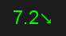
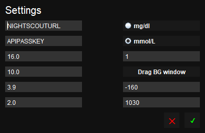

# Nightscout Display

Displays the current blood sugar reading from Nightscout on your desktop.

## Usage

### BG Window

The BG window can be placed anywhere on screen and shows the current blood glucos value along with the trend arrow. The colour is based of the range values in the settings.

### Settings Window

The settings window is accessed from the system tray.

___

_From top left to bottom right_

__Nightscout__

Nightscout URL is the link to your Nightscout server.
 
API Passkey is the API Secret for your Nightscout server.

__BG Range__

Very high BG value
 
High BG value
 
Low BG balue
 
Very Low BG value

__BG Unit__

You can chose between mg/dl or mmol/L

__Request Interval__

How often a new reading will be requested from Nightscout.

__BG Window__

Window X coordinate
 
Window Y coordinate

__OR__ alternatively you can drag the BG window to your desired location.